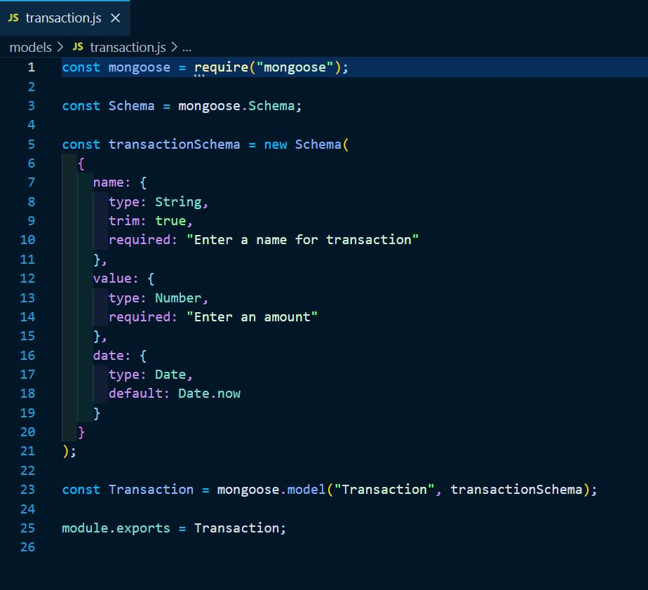
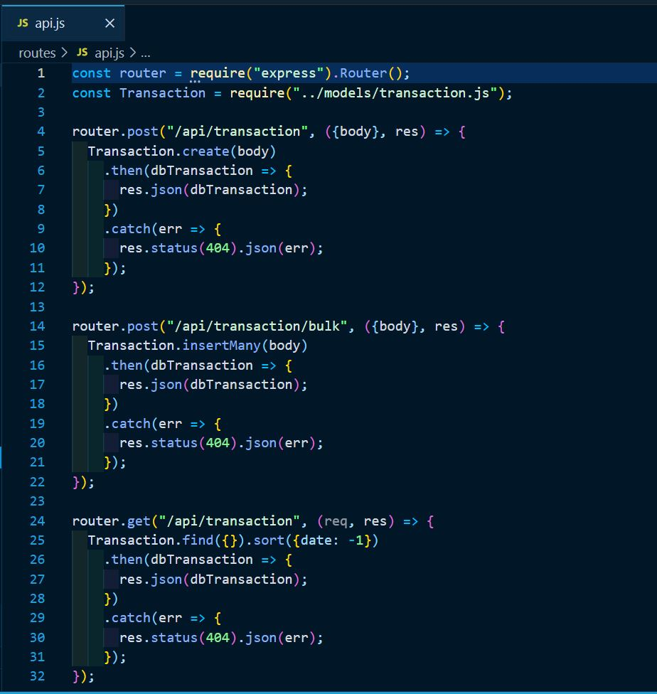
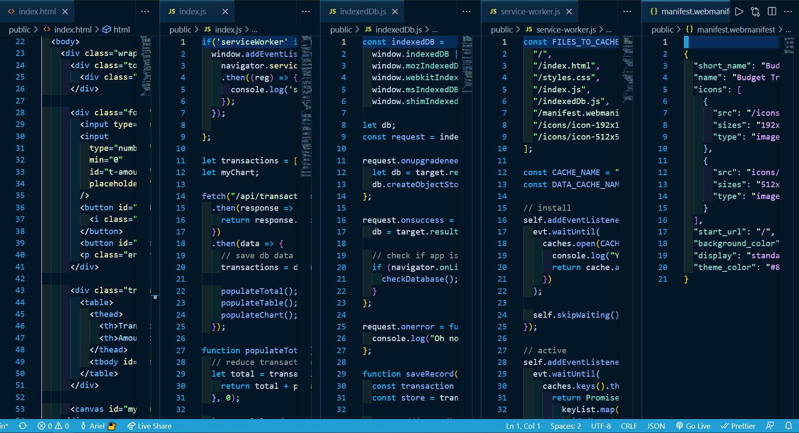
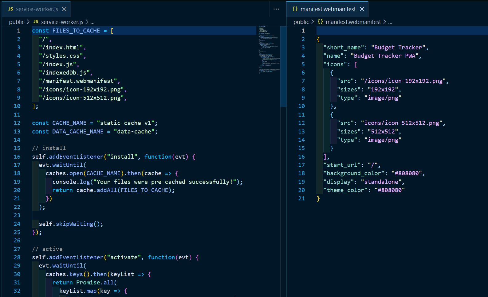
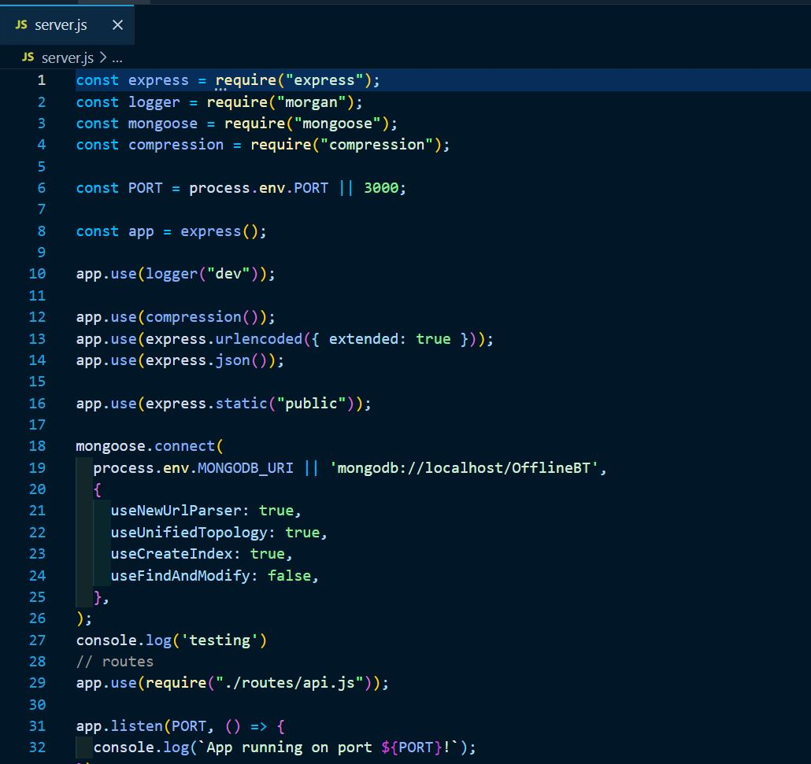
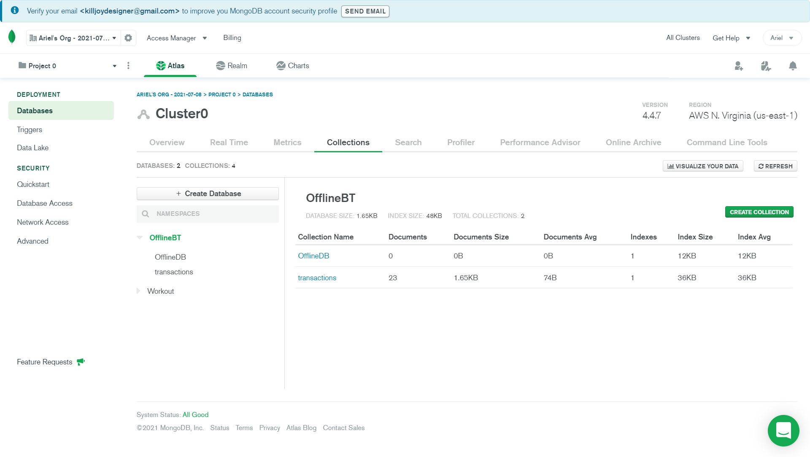
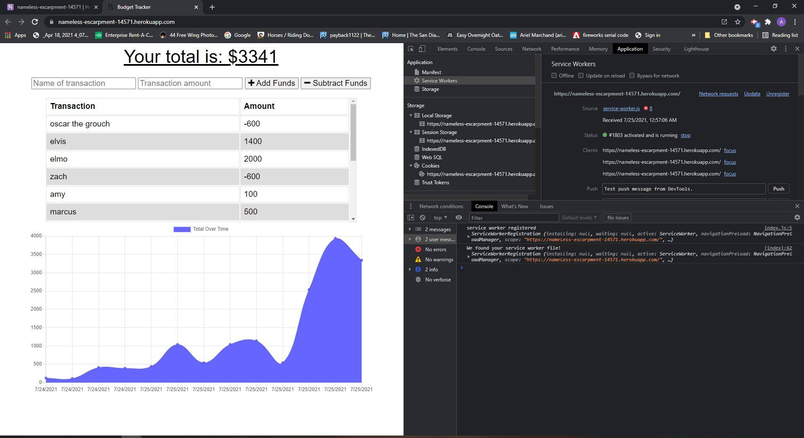

# Unit-19-PWA-Homework-Online-Offline-Budget-Trackers
## Introduction:
For this assignment, I added to our existing Budget Tracker application to allow for offline access and functionality.
So that the user will be able to add expenses or deposits to their budget with or without being online. When entering transactions offline, they should able to populate the total when brought back online.

I created a demo app that you can use on this link:
 [Offline Budget App](https://nameless-escarpment-14571.herokuapp.com/)

 
 

## Technologies used:

* compression
* express"
* lite-server
* mongoose
* morgan

 
 

### Screenshot of Model Code

 
 

### Screenshot of Routes code

 
 

### Screenshots of Public Folder

 
 

### Screenshot of Server code

 
 

### Screenshot of Mongo Atlas workout database

 
 

### Finished Heroku app pop out screenshot

 
 

### Finished Heroku app Offline screenshot

 
 

### Finished Heroku app Online screenshot

